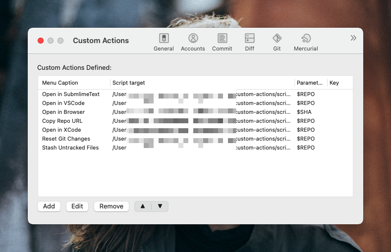

# SourceTree custom actions
Useful [SourceTree](https://www.sourcetreeapp.com/) custom actions bash scripts. It can enable you to:
- Open current repo in Sublime Text
- Open current repo in VS Code
- Open Select commit in Browser(Support github/gitlab)
- Copy current Repo Url to Clipboard
- Open XCode project in XCode

Tested on Mac, but should work on Linux and Windows(Win10 with SubLinux) too(you may need to alter application path in the scripts)

## how to install

1. [download this repo](https://github.com/oe/sourcetree-custom-actions/archive/master.zip)
2. unzip and copy `scripts` to some untouched folder, like SourceTree's application data directory `~/Library/Application Support/SourceTree/`
3. open `SourceTree` Go to `Preferences -> Custom Actions -> Add` and fill custom action with parameters as shown in the figure(add a shortcut if you wish): 

## Tips
If you are using Mac, when browser a repo with SourceTree, you may press <kbd>⌘</kbd> + <kbd>shift</kbd> + <kbd>/</kbd> and type the menu item name then press <kbd>enter</kbd> to call that menu

You may need to add execution permission via `chmod +x *.sh` when an error `permission denied` shown up.

